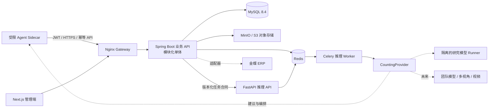

# 路线 B+ 可持续架构草案

状态：Architecture Baseline  
日期：2026-08-18

## 1. 设计原则

1. 业务证据与模型研究解耦。YOLO/Agent 只能通过版本化 Provider 合同读取对象存储、返回候选结果，不能直写业务库。
2. 离线优先不是缓存页面，而是本地持久草稿、媒体物化、可重放 Outbox 和幂等服务端状态机的组合。
3. Clean-room 重构。`eg/` 只帮助确认需求覆盖和页面信息层级，不复制实现、命名、SQL、接口、文案与素材。
4. 先模块化单体，后按证据拆分。Spring 主服务内部按业务域隔离，但 P0 不引入不必要的分布式事务。
5. 所有自动判断可降级、可追溯、可人工接管；没有模型时宁可进入复核，也不伪造数量。

## 2. 运行视图



## 3. 工程与模块边界

| 工程 | 内部模块 | 拥有的数据/行为 | 禁止事项 |
|---|---|---|---|
| Flutter | auth、master-data、capture、gallery、outbox、inventory | 草稿、本地媒体索引、同步游标、上传操作 | 生成伪计数；未 Commit 就删除原图 |
| Spring | identity、organization、capture、media、inventory、review、audit、erp、inference | 业务状态、权限、幂等、审计、结果口径 | 引入训练代码；让推理服务直写 MySQL |
| Next.js | operations、review、reporting、configuration | 管理视图和人工操作入口 | 绕过业务 API 直接写库 |
| Python | contract、providers、jobs、golden-regression | 模型加载、推理、标准化检测结果 | 决定最终业务数量；保存用户权限状态 |
| 基础设施 | gateway、mysql、redis、object-storage | 持久化、队列、证据对象和入口 | 默认公开桶；生产默认口令 |

Spring P0 采用模块化单体：每个域拥有自己的 Controller/Application/Domain/Infrastructure 包和表访问接口，跨域只通过应用服务或显式事件，不允许 Controller 直接调用其他域 Mapper。达到独立扩缩容、独立发布或资源隔离的真实证据后，才提议拆服务。

## 4. 状态机

客户端采集包：

```text
draft -> queued -> uploading -> synced
                 \-> failed -> queued
```

- Blob 物化与哈希完成后才能离开 draft。
- 只有服务端 Commit 成功才标记 synced。
- failed 必须保留错误码、重试次数和下一次重试时间；不得丢失原图。

服务端盘点：

```text
draft -> submitted -> processing -> confirmed
                           \-----> review_required -> confirmed
```

上传包状态单独为 `awaiting_blobs -> awaiting_manifest -> ready_to_commit -> committed`。Commit 是上传合同终点，不等价于推理成功。三视图 Provider 未验收、疑似重复、低质量或 Provider 不可用都进入 review_required。

## 5. 数据与一致性策略

- UUID 由客户端生成，`X-Idempotency-Key` 约束一次业务意图；同键不同载荷返回 409。
- 组织范围 `(organization_id, sha256)` 唯一，避免同图跨栏舍重复，同时不泄露其他组织信息。
- Manifest 和 Commit 在 MySQL 事务内做状态 CAS；任务使用事务 Outbox 投递，避免“业务已提交但任务丢失”。
- 媒体对象先写临时键并校验，再由业务事务记录正式引用；孤儿对象由定时任务按安全窗口回收。
- 日盘点更正使用版本和审计事件，不覆盖历史值。推理结果保存 `model_key + version + checksum + adapter_version + source`。
- Redis/Celery 只作为任务传输，不是业务事实来源；重放任务必须幂等。

## 6. 安全、隐私与审计

- 生产 API 必须启用 OIDC/JWT、组织成员关系和角色授权；开发免鉴权 Profile 不得部署到共享网络。
- App 令牌进入系统安全存储；日志不记录密码、令牌、完整对象签名 URL 或 EXIF 隐私字段。
- MinIO/S3 桶默认私有，通过短期签名地址访问。生产 TLS 在网关终止。
- 删除、解锁、人工改数、ERP 覆盖、模型重跑均产生不可变 AuditEvent。
- 未明确数据保留期前不得自动清理业务证据。

## 7. 扩展点

- `CountingProvider`：Unavailable、Mock（仅自动化测试）、ResearchHttpYolo（强制复核）、HttpYolo（已验收）、未来 MultiView/Video。
- `ErpOrganizationProvider`：Manual、Mock、未来 Kingdee。
- `ObjectStorage`：使用 S3 合同，MinIO 可替换为云对象存储。
- Flutter `InferenceAdapter`：默认 Server；未来端侧实验必须隔离开关并记录来源。
- Provider 能力通过 `/api/v1/system/capabilities` 暴露，客户端按真实能力显示入口。

### 模型 Runner 与 Agent 边界

- 任何第三方或研究模型都部署在产品仓库和业务网络边界之外，只实现 `CountingJobRequest -> CountingJobResult` 的 HTTP 合同；源码、权重、训练依赖和对象存储凭据不进入产品 Git。
- `research-http-yolo` 是显式实验开关，成功响应也会被标准化为 `review_required` 与空计数。只有许可证、金标回归、校准和运营负责人批准齐全时，才允许以 `http-yolo` 启用自动计数。
- Agent 只能作为只读检索、任务编排和复核建议 Sidecar：不得伪造推理回调、写 MySQL、确认盘点、解锁媒体或覆盖模型结果。需要改变业务事实时，必须调用已有的受鉴权 API，并保留人类确认与 AuditEvent。
- 团队自研模型替换时只新增/切换 Runner 配置及模型身份；若合同语义需要演进，先发布兼容的新 adapter 版本，再迁移消费者。

## 8. 迁移路径

1. 以 OpenAPI、Flyway 和验收用例固定 B+ 合同。
2. 将 Django 已验证行为逐项转为黑盒合同测试，在 Spring 独立实现；不翻译源码。
3. Flutter 从演示页面切换到 Repository + UseCase + Drift 数据源，首先跑通离线采集。
4. Next.js 接真实只读态势，再依次开放复核和管理员写操作。
5. Spring 上传闭环通过 AC-01 至 AC-12 后，Django 原型方可由负责人决定归档。
6. 真实 YOLO Provider 通过金标和许可证门禁后再启用，Agent 始终在稳定 Provider 之后演进。
